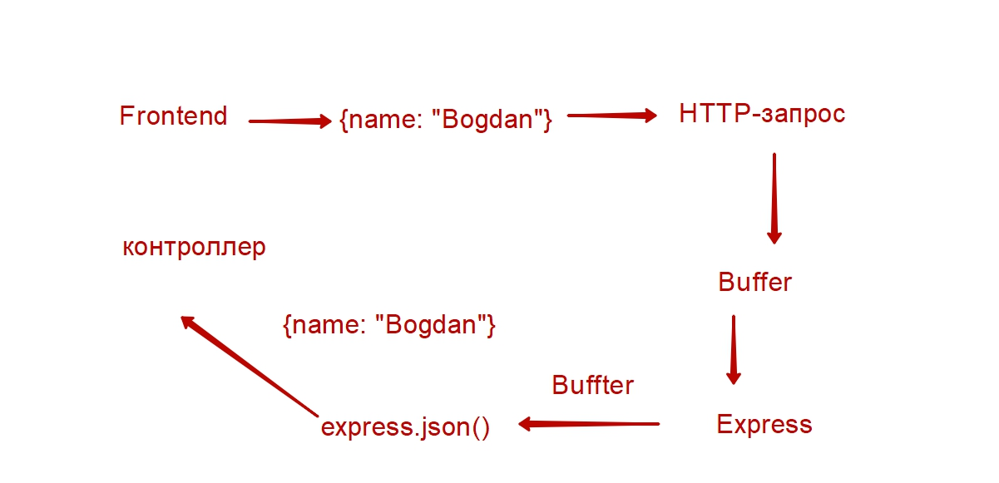
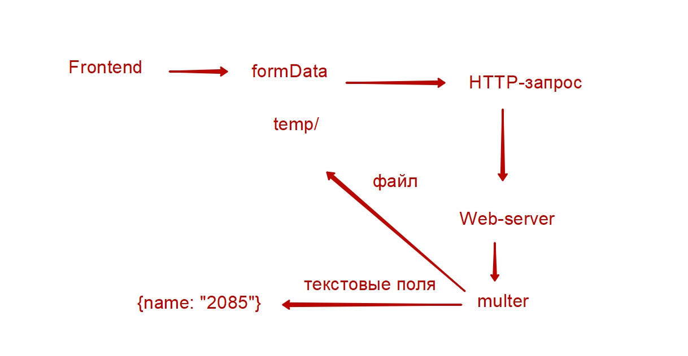
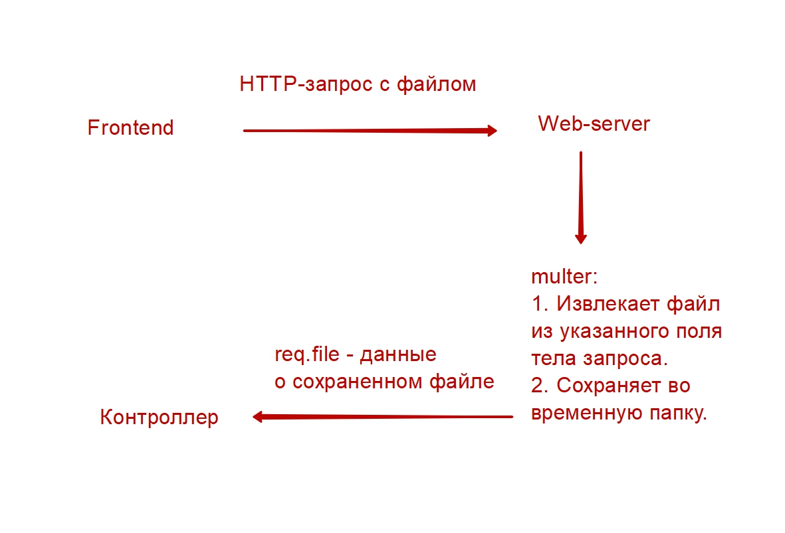
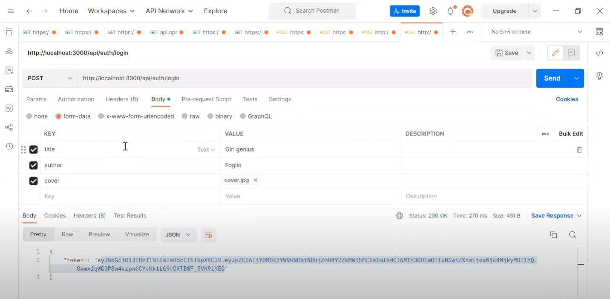

### node.js-mod05-multer-example

#### JSON (text) -> express.json

#### formaDate (text+files) ->  middleware multer

#### formaDate (text+files) ->  multer -> req.body req.file[s] files to tmp directory

#### Postman
